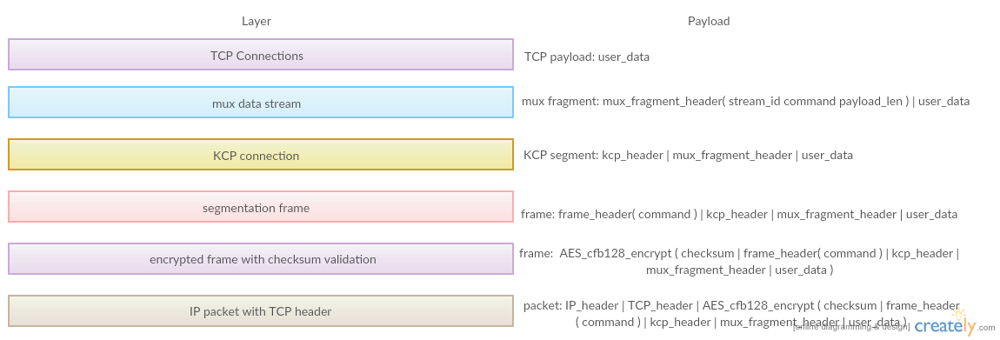

kcptun-raw
----------
为缓解部分ISP对UDP断流的问题，通过伪造TCP报文，实现了简化版的 [kcptun](https://github.com/xtaci/kcptun)。  
kcp的下层通信方式是带伪TCP报头的packet，通过raw socket实现，需要通过iptables绕过内核协议栈。

Inspired by [linhua55/some_kcptun_tools/relayRawSocket](https://github.com/linhua55/some_kcptun_tools/tree/master/relayRawSocket) .

Features
--------
* 模拟TCP三次握手、动态seq/ack（有时需要关闭），以适应各种ISP环境。  
* 两层心跳保活、快速恢复、更改随机端口重连，不容易卡死。  
* AES_CFB128加密帧。  
* 取消了FEC，丢包处理策略直接由kcp负责。  
* 请注意一个服务端进程对应一个客户端进程，如需建立多隧道或多客户端，请换个端口运行多个服务端进程。  
* 暂时仅支持linux，可配置虚拟机并让真机连接至虚拟机。  

Updates
-------
* 2017.9.5 引入内核态过滤器（BPF），提高收包性能  
* 2017.9.7 【客户端】增加自动源地址判定，原`LOCAL_IP`参数变更为`LISTEN_IP`，作用变更为TCP监听绑定IP，可以使用`0.0.0.0`或`127.0.0.1`

Compilation
-----------
编译依赖：`libev-devel`, `openssl-devel`, `automake`, `autoconf`
```
$ ./autogen.sh
$ ./configure
$ make
$ sudo make install
```

#### Openwrt编译指南：  
依赖准备：
```
$ cd OpenWRT-SDK-XXX
$ scripts/feeds update
$ scripts/feeds install libev
$ make menuconfig #勾选Libraries->libev
$ make V=99
```
交叉编译：
请参考 [Cross Compile](https://wiki.openwrt.org/doc/devel/crosscompile)  
以ar71xx 15.05.1 SDK为例：
```
$ export PATH=$PATH:(your toolchain/bin directory here)
$ export STAGING_DIR=(your staging_dir directory here)
$ cd kcptun-raw
$ ./autogen.sh
$ ./configure --build=architecture-unknown-linux-gnu \
--host=mips-openwrt-linux-uclibc \
CFLAGS="-I${STAGING_DIR}/target-mips_34kc_uClibc-0.9.33.2/usr/include" \
LDFLAGS="-L${STAGING_DIR}/target-mips_34kc_uClibc-0.9.33.2/usr/lib"
$ make
```
编译产出binary: `src/kcpraw_client` , `src/kcpraw_server`


Usage
-----
服务端：
```
# iptables -A INPUT -p tcp --dport SERVER_PORT -j DROP
# kcpraw_server TARGET_IP TARGET_PORT SERVER_IP SERVER_PORT [--key 16_BYTES_KEY] [--mode MODE] [--noseq]
```
客户端：
```
# iptables -A INPUT -p tcp -s SERVER_IP --sport LISTEN_PORT -j DROP
# kcpraw_client SERVER_IP SERVER_PORT LISTEN_IP LISTEN_PORT [--key 16_BYTES_KEY] [--mode MODE] [--noseq]
```

#### 示例：
将`108.0.0.1`替换为服务器IP，注意该IP应该是服务器上**对外网卡直接绑定的IP**，如果服务器在局域网内，请填写分配到网卡的局域网IP。
服务端：
```
# iptables -A INPUT -p tcp --dport 888 -j DROP
# kcpraw_server 127.0.0.1 8388 108.0.0.1 888 --mode fast2
```
客户端：
```
# iptables -A INPUT -p tcp -s 108.0.0.1 --sport 888 -j DROP
# kcpraw_client 108.0.0.1 888 0.0.0.0 8388 --mode fast2
$ sslocal -s 127.0.0.1 -p 8388 -k YOUR_SS_KEY
```

如果客户端log中有大量`Re-init fake TCP connection`并且频繁断流，请尝试在客户端和服务端的命令都添加`--noseq`参数。

可选参数说明：  
* `[--mode MODE]` 加速模式，取值为`normal/fast/fast2/fast3`。默认为`fast3`。  
* `[--noseq]` 如果添加该参数，则取消伪TCP头的seq/ack自增，可避免部分ISP环境下的断流情况。  
* `[--key 16_BYTES_KEY]` AES128密钥，长度必须为16字节。默认为`it is a secrect!`。  
* `[--nobpf]` 禁用伯克利包过滤（BPF）模式。  

分层示意图
--------

